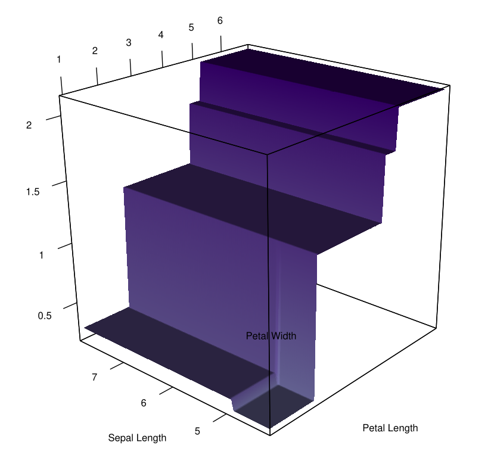

# Random Forests for Regression with Missing Entries
These are the source codes used in the articles:

* <a href="https://doi.org/10.1080/10485252.2023.2219783" target="_blank"> Irving Gómez-Méndez & Emilien Joly (2023). On the consistency of a random forest algorithm in the presence of missing entries,
Journal of Nonparametric Statistics. </a>
* <a href="https://doi.org/10.1080/00949655.2022.2163646" target="_blank"> Irving Gómez-Méndez & Emilien Joly (2023). Regression with missing data, a comparison study of techniques based on random forests,
Journal of Statistical Computation and Simulation. </a>

More specific codes for the creation of the datasets with missing values, the construction of the random forests for each missing-data mechanism, etc. can be found in https://github.com/IrvingGomez/RandomForestsSimulations.

There, it is possible to find examples on its use, in particular the example <a href="https://github.com/IrvingGomez/Random_forests_with_missing_values/blob/main/examples/Example_Anderson%20iris.ipynb">Example_Anderson iris.ipynb</a> shows most of the features.

---
### Example of a recursive tree with missing entries.

---
**License**: All the codes are under the [GNU GPL v3](https://www.gnu.org/licenses/gpl.html) license or any posterior version.

:copyright: (21-05-2021) Irving Gómez Méndez.
